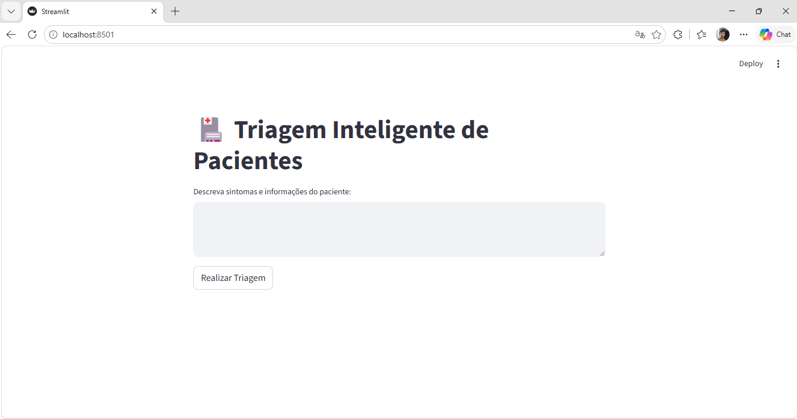
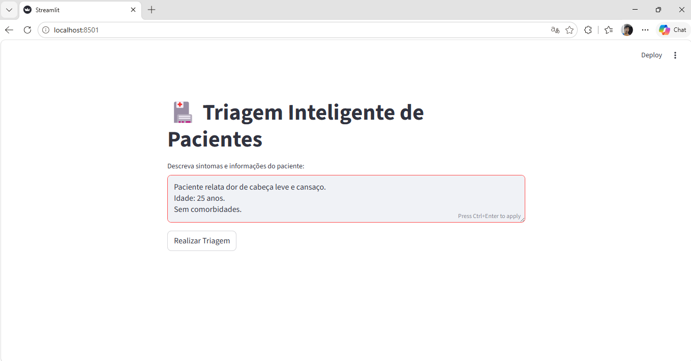
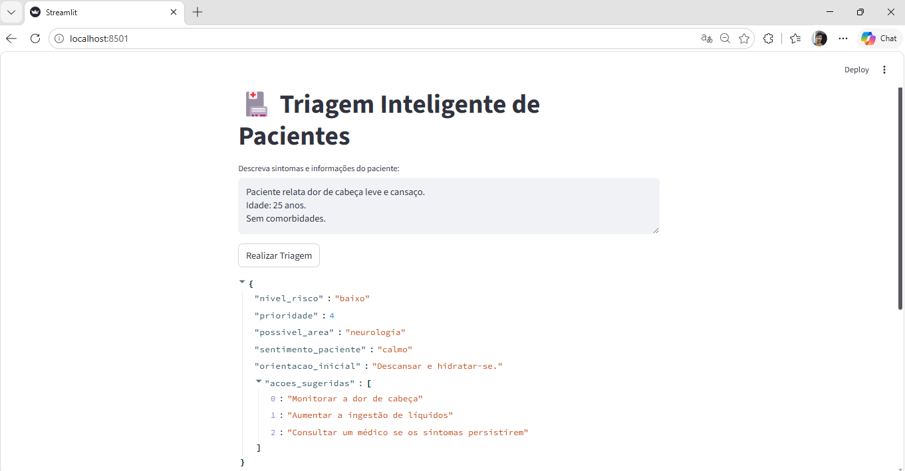
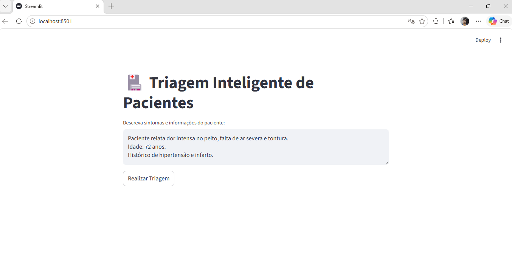
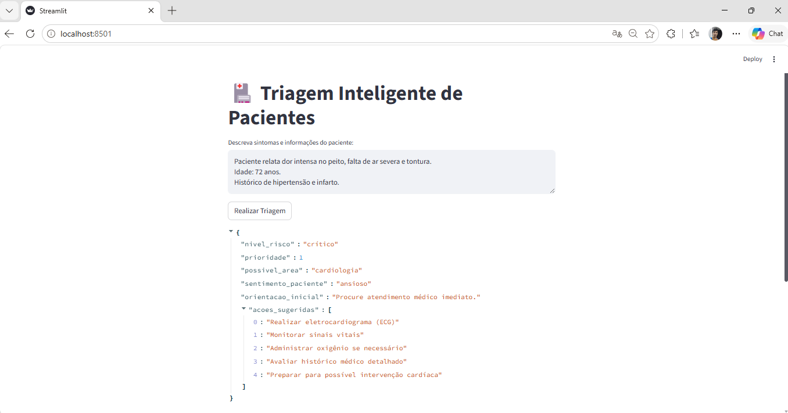
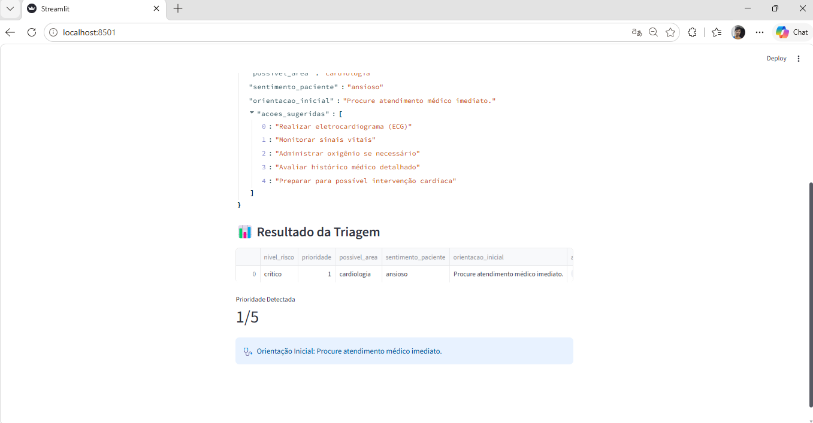

# 🏥 Projeto: Triagem Inteligente de Pacientes com IA

Sistema inteligente de apoio à triagem hospitalar utilizando Inteligência Artificial, análise de dados e dashboards interativos.

---

# 📌 Objetivo

Desenvolver um sistema inteligente capaz de:

- realizar triagem automática de pacientes;
- classificar risco clínico;
- sugerir prioridade de atendimento;
- indicar possível área médica;
- gerar orientações iniciais;
- analisar dados hospitalares;
- produzir relatórios gerenciais com IA.

---

# 🚀 Funcionalidades

## 🧠 Triagem Inteligente

O sistema utiliza IA para:

- analisar sintomas do paciente;
- identificar nível de risco;
- definir prioridade;
- sugerir especialidade médica;
- gerar orientações iniciais;
- recomendar próximas ações.

---

## 📊 Análise Hospitalar

O sistema também permite:

- leitura de arquivos CSV;
- análise de pacientes;
- geração de gráficos;
- identificação de gargalos;
- criação de relatórios hospitalares inteligentes.

---

# 📸 Demonstração do Sistema

## 🖥️ Interface Inicial

Interface desenvolvida em Streamlit para entrada de dados clínicos.



---

## 🟢 Cenário 1 — Caso Leve

Paciente jovem com sintomas leves.





---

## 🟡 Cenário 2 — Caso Moderado

Paciente com febre e histórico de diabetes.


---

## 🔴 Cenário 3 — Caso Grave

Paciente idoso com sintomas cardíacos graves.





---

## 📊 Dashboard Final

Visualização consolidada da triagem.



---

# 🧠 Parte 1 — Triagem Inteligente

## 📌 Funcionamento

O usuário informa:

- sintomas;
- idade;
- informações clínicas.

A IA:

- analisa os dados;
- calcula prioridade;
- identifica risco;
- sugere especialidade médica;
- gera ações iniciais.

---

# 💻 Tecnologias Utilizadas

- Python
- Streamlit
- OpenAI API
- Pandas
- JSON
- python-dotenv
- Matplotlib

---

# 📌 Exemplo de Entrada

```text
Paciente relata febre há 3 dias, falta de ar leve,
dor no peito e cansaço.
Idade: 67 anos.
Hipertenso.
```

---

# 📌 Exemplo de Saída

```json
{
  "nivel_risco": "médio",
  "prioridade": 3,
  "possivel_area": "Cardiologia",
  "sentimento_paciente": "preocupado",
  "orientacao_inicial": "Realizar avaliação clínica imediata.",
  "acoes_sugeridas": [
    "Monitorar sinais vitais",
    "Solicitar exames laboratoriais",
    "Realizar eletrocardiograma"
  ]
}
```

---

# 📊 Parte 2 — Analisador Hospitalar

## 📌 Objetivo

Analisar dados de vários pacientes para:

- detectar padrões;
- identificar gargalos;
- gerar gráficos;
- produzir relatório executivo hospitalar.

---

# 📁 Estrutura do CSV

```csv
id,nome,idade,especialidade,risco,tempo_espera
1,Ana,67,Cardiologia,alto,45
2,Carlos,22,Clínico,médio,15
3,Marina,80,Pneumologia,crítico,10
```

---

# 📈 O Sistema Analisa

## ✅ Quantidade de pacientes por área

Exemplo:

- Cardiologia
- Pneumologia
- Clínica Geral

---

## ✅ Distribuição de risco

- baixo
- médio
- alto
- crítico

---

## ✅ Tempo médio de espera

Ajuda na gestão hospitalar.

---

## ✅ Gargalos hospitalares

Detecta:

- áreas sobrecarregadas;
- excesso de pacientes críticos;
- demora no atendimento.

---

# 🤖 Relatório Gerado pela IA

O sistema produz automaticamente:

- tendência principal;
- ponto crítico;
- recomendação operacional;
- possível gargalo hospitalar.

---

# 📁 Estrutura do Projeto

```text
health-triage-ai/
│
├── images/
│   ├── 01-tela-inicial.png
│   ├── 02-caso-leve-input.png
│   ├── 03-caso-leve-resultado.png
│   ├── 04-caso-moderado.png
│   ├── 05-caso-grave-input.png
│   ├── 06-caso-grave-json.png
│   └── 07-dashboard-final.png
│
├── patient_triage_ai.py
├── hospital_analytics.py
├── patients.csv
├── requirements.txt
├── README.md
├── .gitignore
└── .env
```

---

# 🧪 Como Executar

## 1️⃣ Clonar o repositório

```bash
git clone https://github.com/IgorBrito02/health-triage-ai.git
```

---

## 2️⃣ Entrar na pasta

```bash
cd health-triage-ai
```

---

## 3️⃣ Criar ambiente virtual

```bash
python -m venv venv
```

---

## 4️⃣ Ativar ambiente virtual

### Windows

```bash
venv\Scripts\activate
```

### Linux/Mac

```bash
source venv/bin/activate
```

---

## 5️⃣ Instalar dependências

```bash
pip install -r requirements.txt
```

---

## 6️⃣ Configurar API

Criar arquivo `.env`

```env
OPENAI_API_KEY=sua_chave_api
```

---

## 7️⃣ Executar triagem inteligente

```bash
streamlit run patient_triage_ai.py
```

---

## 8️⃣ Executar analisador hospitalar

```bash
streamlit run hospital_analytics.py
```

---

# 📦 requirements.txt

```txt
streamlit
openai
python-dotenv
pandas
matplotlib
```

---

# 🎯 Resultados Esperados

O sistema:

- automatiza parte da triagem;
- auxilia profissionais de saúde;
- melhora priorização;
- reduz tempo de análise;
- gera insights hospitalares.

---

# 🚀 Melhorias Futuras

## ✅ Banco de dados SQLite

Salvar histórico de pacientes.

---

## ✅ Dashboard em tempo real

Utilizar Plotly.

---

## ✅ Exportar PDF

Gerar relatório médico automático.

---

## ✅ Login hospitalar

Separar:

- médico;
- enfermeiro;
- administrador.

---

# 🧠 Competências Demonstradas

## ✅ Inteligência Artificial

- NLP
- classificação inteligente
- geração de insights

---

## ✅ Ciência de Dados

- leitura de CSV
- análise de dados
- dashboards

---

## ✅ Desenvolvimento Web

- Streamlit
- integração API
- interface interativa

---

## ✅ Saúde Digital

- triagem hospitalar
- apoio à decisão
- gestão clínica

---

# 🏁 Conclusão

O projeto demonstra como Inteligência Artificial pode auxiliar processos hospitalares, oferecendo suporte à triagem clínica e análise operacional, contribuindo para decisões mais rápidas e eficientes no ambiente de saúde.

---

# 👨‍💻 Autor

Desenvolvido por Igor Pinheiro de Brito.